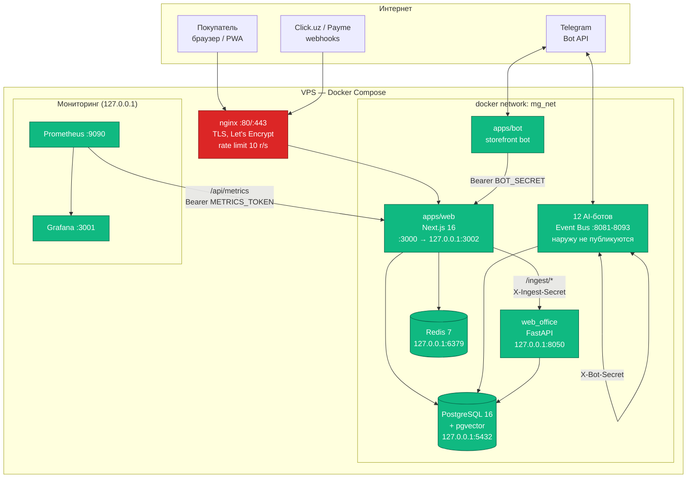
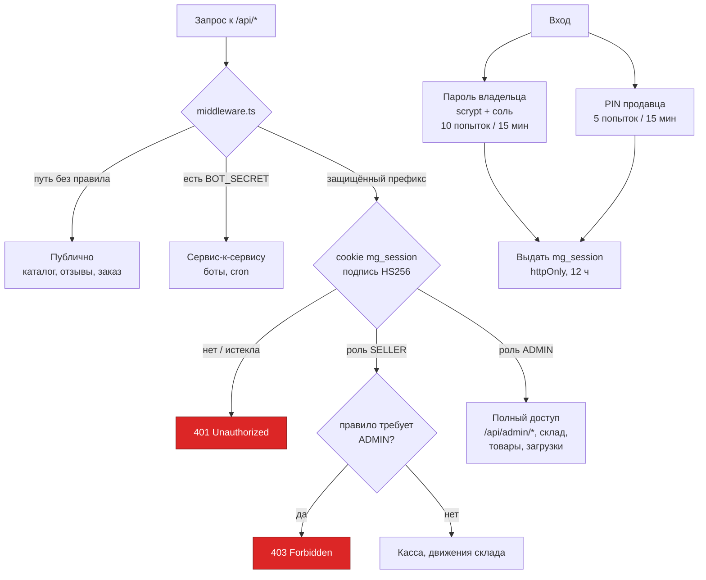
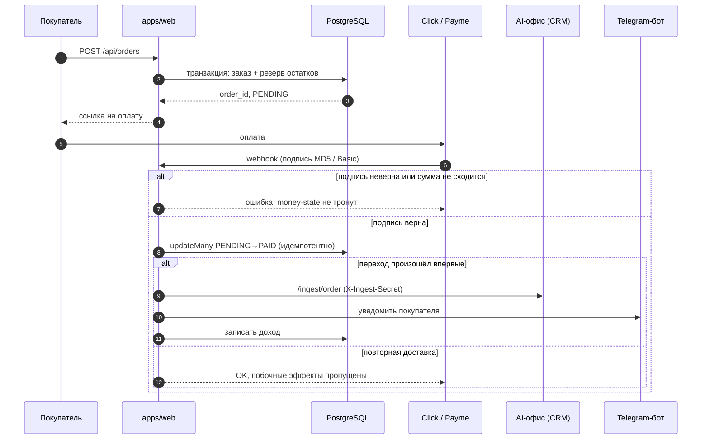
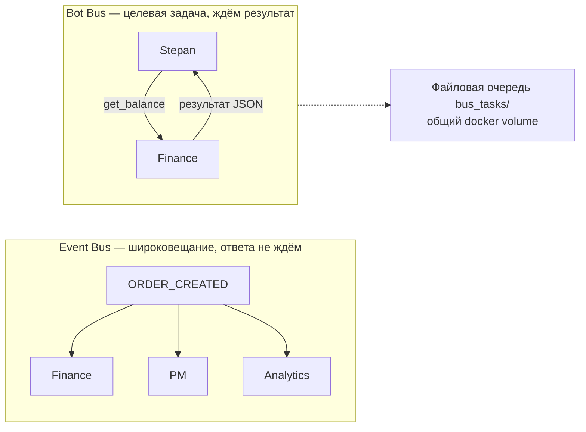
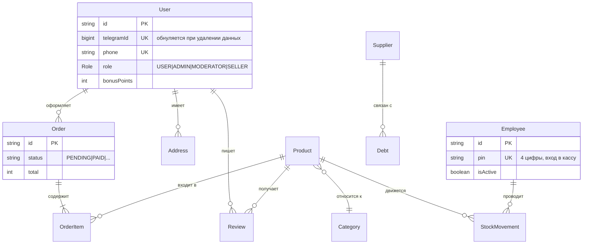
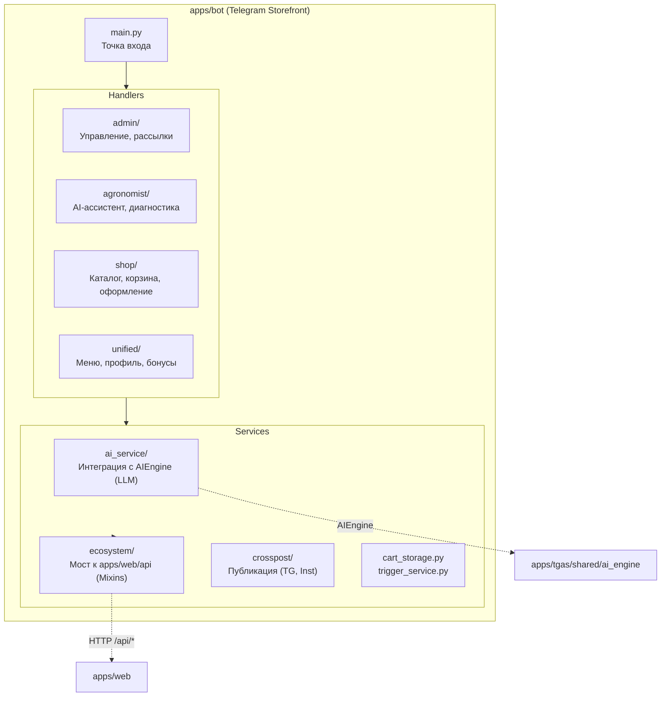

# Architecture — Microgreen Uzbekistan

## System Overview

```
┌──────────────────────────────────────────────────────────────────┐
│                        INTERNET                                  │
│                           │                                      │
│                      nginx (443)                                 │
│                      ┌────┴────┐                                 │
│               microgreenuzbekistan.com                           │
│                           │                                      │
├───────────────────────────┼──────────────────────────────────────┤
│                           │                                      │
│  ┌────────────────────────▼───────────────────────────────────┐  │
│  │              apps/web — Next.js 16 PWA                     │  │
│  │              Port: 3000                                    │  │
│  │                                                            │  │
│  │  Routes:                                                   │  │
│  │  /              → Storefront (catalog, cart, checkout)      │  │
│  │  /catalog       → Product listing                          │  │
│  │  /product/[slug]→ Product detail                           │  │
│  │  /magazine      → FRESH WEEKLY: рубрики, материалы, номера │  │
│  │  /magazine/<рубрика>/<slug> → материал журнала              │  │
│  │  /recipe/[slug] → рецепт (печатный QR) + набор в корзину    │  │
│  │  /admin         → Admin dashboard                          │  │
│  │  /api/*         → 23 API route groups                      │  │
│  └────────────────────────┬───────────────────────────────────┘  │
│                           │                                      │
│  ┌────────────────────────▼───────────────────────────────────┐  │
│  │              PostgreSQL                                    │  │
│  │              Port: 5432                                    │  │
│  │                                                            │  │
│  │  DB: microgreen_db (Prisma — storefront)                   │  │
│  │  DB: microgreen   (SQLAlchemy — AI office)                 │  │
│  └────────────────────────────────────────────────────────────┘  │
│                                                                  │
│  ┌──────────────┐  ┌──────────────┐  ┌──────────────────────┐   │
│  │  apps/bot    │  │  apps/game   │  │  apps/tgas           │   │
│  │  Telegram    │  │  Farm Sim    │  │  AI Office           │   │
│  │  Storefront  │  │  Vite+React  │  │  11 Python bots      │   │
│  │  Bot         │  │  TWA         │  │  Event Bus (HTTP)    │   │
│  │  (aiogram)   │  │              │  │  Ports 8081-8093     │   │
│  └──────────────┘  └──────────────┘  └──────────────────────┘   │
│                                                                  │
│  ┌──────────────┐                                               │
│  │  Redis       │  Cache + Pub/Sub                              │
│  │  Port: 6379  │                                               │
│  └──────────────┘                                               │
└──────────────────────────────────────────────────────────────────┘
```

## Module Boundaries

| Module | Technology | Responsibility | Talks to |
|--------|-----------|---------------|----------|
| `apps/web` | Next.js, React, TypeScript | Storefront, Admin, Magazine, API | PostgreSQL (Prisma) |
| `apps/bot` | Python, aiogram | Telegram orders, AI agronomist | `apps/web/api/*` |
| `apps/game` | Vite, React, TypeScript | Farm Simulator (Telegram Mini App) | `apps/web/api/game` |
| `apps/tgas` | Python, aiogram, FastAPI | 12 AI employees + n8n_bridge | PostgreSQL (SQLAlchemy), Event Bus |
| `packages/database` | Prisma | Schema, migrations, seed | PostgreSQL |

## Communication Patterns

1. **Web ↔ Database**: Prisma Client (direct)
2. **Bot → Web**: HTTP API calls to `/api/*`
3. **Game → Web**: HTTP API calls to `/api/game`
4. **AI Bots ↔ AI Bots**: Event Bus (HTTP POST to container ports 8081-8093)
5. **AI Bots → Telegram**: aiogram Bot API
6. **Web → AI Bots**: FastAPI endpoint on port 8050 (`/ingest/order`)

## Rules

- Never import across module boundaries directly
- `apps/web` is the single source of truth for product data
- `apps/tgas` is the single source of truth for CRM/tasks
- All inter-service communication goes through HTTP APIs or Event Bus
- Database schema changes go through Prisma only

---

# Diagrams

> Диаграммы для технического Due Diligence (§3, «Infratuzilma va arxitektura
> diagrammalari»). Mermaid рендерится прямо в GitHub — отдельный инструмент
> для просмотра не нужен.

## 1. Инфраструктура и сетевые границы

Ключевое свойство: наружу открыт только nginx. Всё остальное слушает либо
внутреннюю docker-сеть `mg_net`, либо `127.0.0.1` — то есть недоступно из
интернета напрямую.



## 2. Модель доступа

Роль проверяется в `middleware.ts` **до** попадания в обработчик, поэтому
новый маршрут под защищённым префиксом закрыт по умолчанию, а не когда про
него вспомнят.



## 3. Оформление и оплата заказа

Переход `PENDING → PAID` — атомарный условный `updateMany`, поэтому
повторная доставка webhook'а не приводит к двойному начислению.



## 4. Взаимодействие AI-сотрудников

Два независимых канала — их легко перепутать, поэтому вынесены отдельно.



## 5. Данные



## 6. Внутренняя архитектура Telegram-бота (apps/bot)

Telegram-бот построен по принципу строгой модульности (лимит 200 строк на файл).


